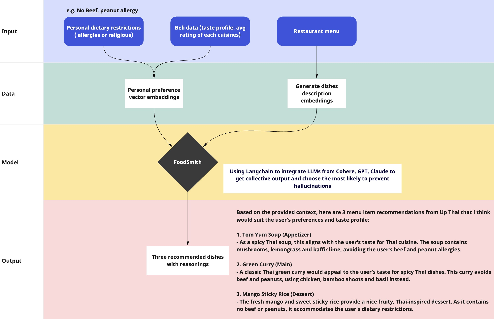

# Foodsmith

## Project Overview

Have you ever found yourself at an international restaurant, facing a menu filled with unfamiliar dish names or languages, uncertain of what to order?

Simply snap a photo of the menu, and our advanced model will provide three dish recommendations tailored specifically for you. The recommendation will based on your cuisine preferences from your average rating of each cuisine in Apps like "Beli", and personal dietary restrictions (such as allergies or religious considerations).

In this project, we integrated Langchain, MongoDB, LLMs(Cohere, GPT, Claude), and streamlit to help us generate the dish recommendation.

## Flowchart of our application

## Streamlit application demo

https://appapppy-cqpypmf7yvoq6c5thslo8u.streamlit.app/
